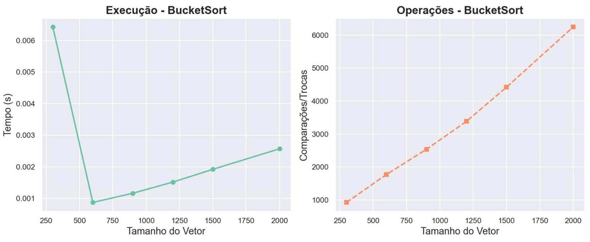
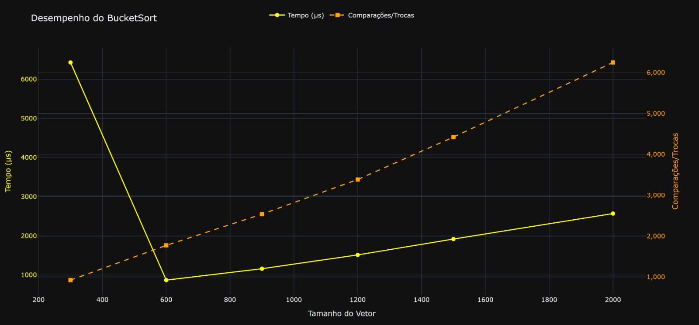
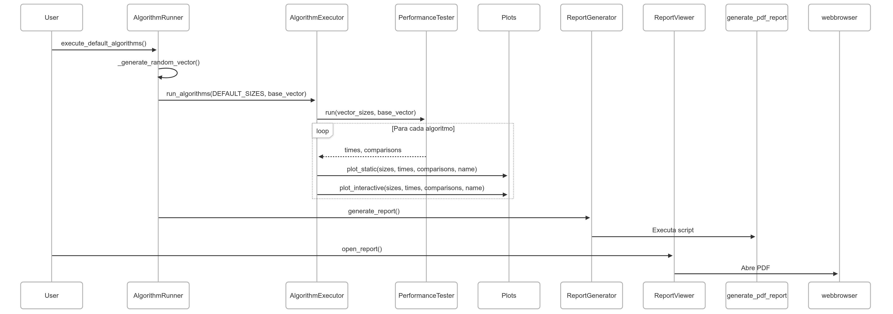
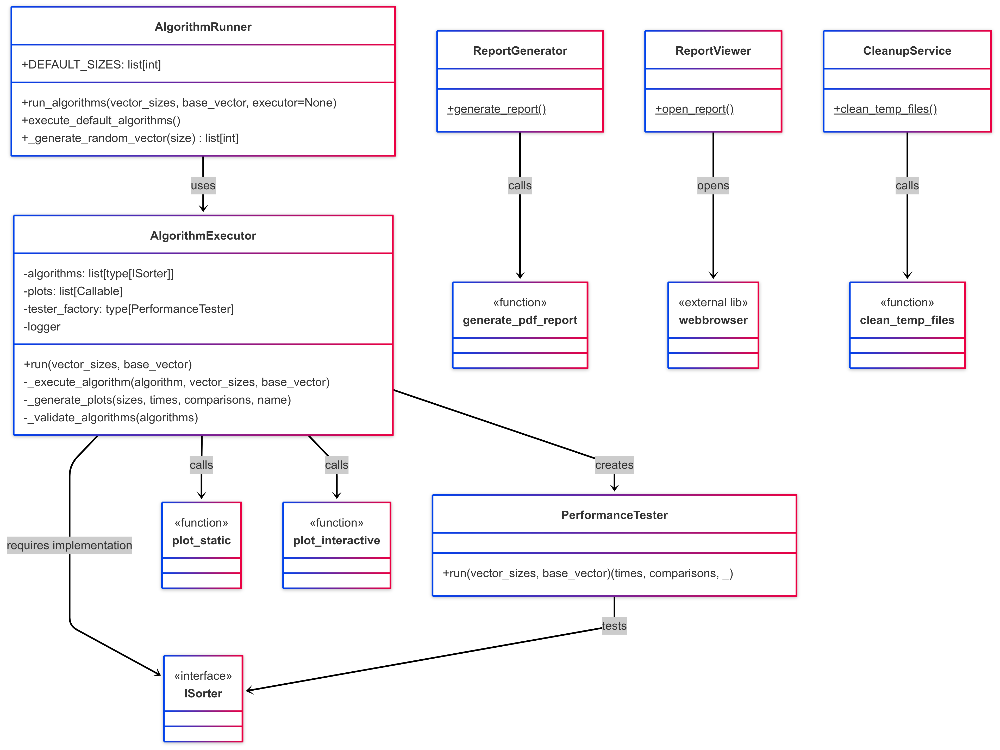

# SortLab  

**Projeto em Python** que executa algoritmos de ordenação, mede performance, exibe gráficos com Matplotlib (via PyQt5) e Plotly, e gera um relatório final em PDF contendo os dados e visualizações com o ReportLab.  

📌 **Funcionalidades**  
- Execução de algoritmos de ordenação com medição de tempo e comparações/trocas.  
- Geração de gráficos interativos (Plotly) e estáticos (Matplotlib).  
- Relatório em PDF com resultados consolidados.  
- Limpeza automática de arquivos temporários.  
- Suporte a múltiplos algoritmos via interface `ISorter`.  


🛠️ **Tecnologias Utilizadas**
- Python
- Matplotlib + PyQt6 para visualização gráfica
- Plotly para gráficos interativos
- ReportLab para geração de PDF
- Pytest-cov para testes


📦 **Instalação**  

Clone o repositório:

```bash
git clone https://github.com/glaucoSapucaia/SortLab.git .
```

Instale as dependências:

Windows

```bash
python -m venv venv
.\venv\Scripts\activate
pip install -r requirements.txt  
```

Linux

```bash
python3 -m venv venv
source venv/bin/activate
pip install -r requirements.txt  
```

▶️ **Como Executar**

**Execução Padrão** (com configurações pré-definidas)

Windows

```bash
python ./main.py
```

Linux

```bash
python3 ./main.py
```

Gera relatório PDF automaticamente e abre no navegador padrão.


**Personalização**  

Modifique os parâmetros em `sortlab.pipeline.execution.py` (Tamanho dos vetores)

```python
class AlgorithmRunner:
    """Coordena a execução de algoritmos de ordenação com configurações padrão."""

    DEFAULT_SIZES = [300, 600, 900, 1200, 1500, 2000]
    """Lista de tamanhos de vetores usados para testes de desempenho padrão."""

    @staticmethod
    def run_algorithms(
        vector_sizes: list[int],
        base_vector: list[int],
        executor: AlgorithmExecutor | None = None,
    ) -> None:
        """Executa os algoritmos de ordenação nos vetores especificados.

        Args:
            vector_sizes: Tamanhos dos vetores a serem testados
            base_vector: Vetor base que será copiado e ordenado
            executor: Executor personalizado (usa o padrão se None)
        """
        executor = executor or AlgorithmExecutor(
            algorithms=get_sorting_algorithms(), plots=[plot_static, plot_interactive]
        )
        executor.run(vector_sizes, base_vector) 
```

Crie novos algorítimos em `sortlab.functions` (Exemplo: CountingSort)

```python
class CountingSort(ISorter):
    """Implementação do algoritmo Counting Sort para ordenação de inteiros não-negativos."""

    def __init__(self, counter: IMetricCounter) -> None:
        """Inicializa o Counting Sort com contador de métricas.

        Args:
            counter: Objeto para contabilizar operações do algoritmo.
        """
        self.counter = counter
        logger.info(f"{self.__class__.__name__} inicializado com contador.")

    def counting_sort(self, input_array: list[int]) -> list[int]:
        """Implementa o algoritmo Counting Sort.

        Args:
            input_array: Lista de inteiros não-negativos a ser ordenada.

        Returns:
            Lista ordenada em ordem crescente.

        Raises:
            EmptyArrException: Se a lista de entrada estiver vazia.
            SortingException: Se ocorrer erro durante a ordenação.
        """
        try:
            if not input_array:
                logger.warning(f"{self.__class__.__name__} - Lista vazia.")
                raise EmptyArrException(f"{self.__class__.__name__} - Lista vazia.")

            k = max(input_array) + 1
            sorted_array = [0] * len(input_array)
            count_array = [0] * k

            # Fase de contagem
            for value in input_array:
                count_array[value] += 1
                self.counter.increase()

            # Fase de soma cumulativa
            for i in range(1, k):
                count_array[i] += count_array[i - 1]
                self.counter.increase()

            # Fase de ordenação
            for value in reversed(input_array):
                sorted_array[count_array[value] - 1] = value
                count_array[value] -= 1
                self.counter.increase()

            # Contagem adicional para métricas
            for i in range(1, k):
                self.counter.increase()

            return sorted_array

        except Exception as e:
            logger.error(f"Erro no {self.__class__.__name__}: {e}")
            raise SortingException(f"Erro no {self.__class__.__name__}: {e}")

    def sort(self, input_array: list[int]) -> list[int]:
        """Interface pública para ordenação, implementando ISorter.

        Args:
            input_array: Lista de inteiros não-negativos a ser ordenada.

        Returns:
            Lista ordenada em ordem crescente.

        Raises:
            SortingException: Se ocorrer erro durante a ordenação.
        """
        try:
            return self.counting_sort(input_array)
        except SortingException:
            logger.error(f"Erro ao ordenar com {self.__class__.__name__}.")
            raise
```


🏗️ **Estrutura do Código | sortlab.pipeline**

```
sortlab/  
├── pipeline/  
│   ├── algorithm_executor.py    # Executa algoritmos e gera gráficos  
│   ├── cleanup.py               # Limpeza de arquivos temporários  
│   ├── execution.py             # Ponto de entrada padrão  
│   ├── open_report.py           # Abre o relatório PDF  
│   └── report.py                # Gera o relatório final  
```


📊 **Exemplo de Saída**

Gráficos:






📝 **Principais Dependências**

- matplotlib==3.10.1
- plotly==6.0.1
- PyQt6==6.9.0
- reportlab==4.4.0

[Lista completa em requirements.txt]

📊 **Diagramas | sortlab.pipeline**





🤝 **Contribuição**

Faça um fork do projeto.

Adicione novos algoritmos (implementando ISorter).

Envie um PR!

**Desenvolvido com Python e** ❤️